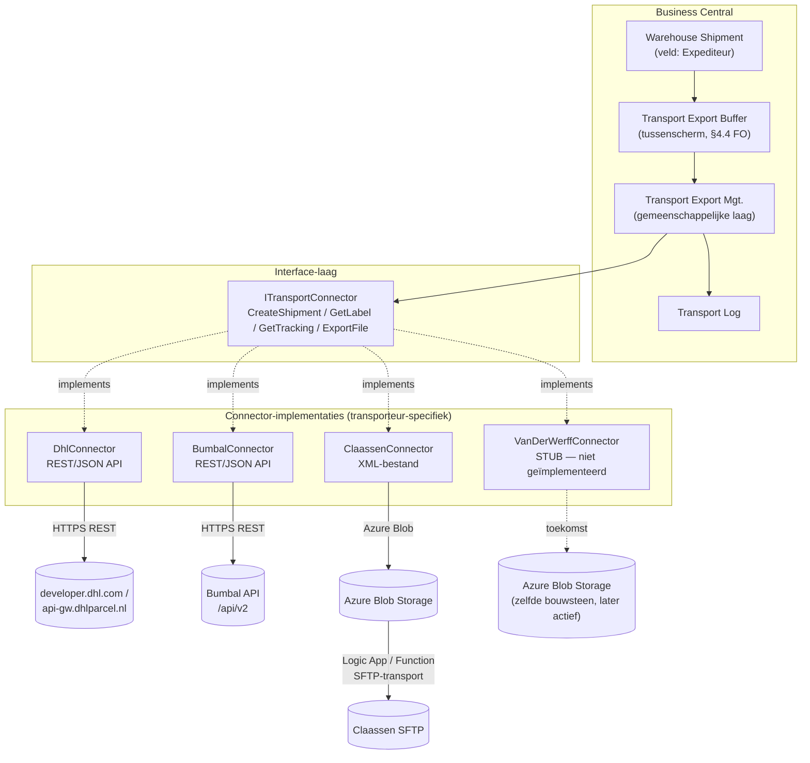

# Bouwplan – Extensie "Koppeling met Transporteurs" (AL / Business Central)

**Project:** Maiburg Hout B.V. – koppeling DHL · Bumbal · Claassen Transport · Van der Werff ↔ Microsoft Dynamics 365 Business Central
**Basis:** Functioneel Ontwerp "Koppeling met transporteurs" v1.1 (24 juni 2026), hoofdstuk 7 "Technische uitwerking"
**Doel van dit document:** technisch bouwplan voor het ontwikkelen van de AL-extensie in Visual Studio Code, inclusief projectopzet, objectstructuur, per-transporteur uitwerking en API-onderzoek voor DHL en Bumbal.
**Status:** concept, ter voorbereiding van de bouw

---

## Inhoudsopgave

1. [Scope van deze bouwfase](#1-scope-van-deze-bouwfase)
2. [VS Code projectopzet](#2-vs-code-projectopzet)
3. [Architectuur](#3-architectuur)
4. [Datamodel — AL-objecten](#4-datamodel--al-objecten)
5. [Pagina's (UI)](#5-paginas-ui)
6. [Business logic — uitwerking](#6-business-logic--uitwerking)
7. [Uitwerking per transporteur](#7-uitwerking-per-transporteur)
   - 7.1 [DHL — bouwen](#71-dhl--bouwen-api)
   - 7.2 [Bumbal — bouwen](#72-bumbal--bouwen-api)
   - 7.3 [Claassen Transport — bouwen](#73-claassen-transport--bouwen-bestand--xml)
   - 7.4 [Van der Werff — alleen voorbereiden](#74-van-der-werff--alleen-voorbereiden-niet-bouwen)
8. [Beveiliging en instellingenbeheer](#8-beveiliging-en-instellingenbeheer)
9. [Testplan](#9-testplan)
10. [Bouwvolgorde / fasering](#10-bouwvolgorde--fasering)
11. [Openstaande punten](#11-openstaande-punten)
12. [Bronnen](#12-bronnen)

---

## 1. Scope van deze bouwfase

Conform de afspraak met Maiburg wordt in deze fase het volgende **daadwerkelijk gebouwd**:

| Transporteur | Koppeltype | Bouwstatus |
| --- | --- | --- |
| DHL | API (REST/JSON) | ✅ Volledig bouwen |
| Bumbal | API (REST/JSON) | ✅ Volledig bouwen |
| Claassen Transport | Bestand (XML, via Azure Blob Storage) | ✅ Volledig bouwen |
| Van der Werff | Bestand (XML, in- en uitgaand) | ⏸️ **Alleen voorbereiden** — de inhoudelijke uitwerking (hoe de XML eruit moet komen te zien: schema, elementen, mapping) wordt **nog niet ontwikkeld**. Wel wordt de generieke architectuur zo opgezet dat Van der Werff er later, inclusief een eventuele toekomstige API, zonder herontwerp bij kan. |

Dit sluit aan op FO §5.4 en §7.6: Van der Werff werkt aan een toekomstige API-oplossing waarvan de opleverdatum nog niet bekend is, en het XML-schema van de huidige bestandsuitwisseling is nog niet vastgesteld (zie openstaand punt #4 in het FO). Het zou dus verspilde bouwtijd zijn om nu al mapping-logica te schrijven die mogelijk moet worden overgedaan.

**Concreet betekent "voorbereiden" voor Van der Werff in deze bouwfase:**
- De connector staat als inactieve rij in de Transportkoppeling-tabel.
- Er is een lege/stub-codeunit die de `ITransportConnector`-interface implementeert (zodat het geheel compileert en het tussenscherm de koppeling kan tonen), maar die bij aanroep een duidelijke "nog niet geïmplementeerd"-fout geeft.
- De Azure Blob Storage-container en de generieke bestands-infrastructuur (dezelfde bouwstenen als bij Claassen) worden zodanig generiek opgezet dat ze later voor Van der Werff hergebruikt kunnen worden.
- Er wordt **geen** XML-schema, elementstructuur of veldmapping voor Van der Werff gebouwd of vastgelegd — dat volgt zodra Maiburg/Van der Werff het schema aanlevert (openstaand punt #4).

**Buiten scope** (ongewijzigd t.o.v. FO §1): inkoop-/inboundtransport en retourstromen, financiële afhandeling/facturatie van transportkosten.

---

## 2. VS Code projectopzet

### 2.1 Benodigde tooling

| Tool | Doel |
| --- | --- |
| Visual Studio Code | Ontwikkelomgeving |
| **AL Language** extensie (Microsoft) | Taalondersteuning, compiler, debugger voor AL |
| Business Central sandbox-omgeving (of Docker BC-container) | Test/ontwikkelomgeving om tegen te compileren en te debuggen |
| Git (+ Azure DevOps of GitHub repo) | Versiebeheer |
| Postman / Insomnia (of `.http`-bestanden in VS Code met REST Client) | Handmatig testen van DHL- en Bumbal-API-calls buiten AL om, voordat ze in `HttpClient`-code worden gebouwd |
| AL Test Runner (VS Code extensie, optioneel) | Uitvoeren van AL-testcodeunits vanuit VS Code |
| CRS AL Language Extension (optioneel, community) | Object-ID-beheer, snippets, rename-tools |

### 2.2 Nieuwe AL-app aanmaken

```
Ctrl+Shift+P → AL: Go!
```

Dit genereert `app.json`, `.vscode/launch.json`, `.vscode/settings.json` en een `HelloWorld.al`.

### 2.3 `app.json` — richtlijnen

```json
{
  "id": "<nieuwe-guid>",
  "name": "Maiburg Transport Koppelingen",
  "publisher": "GAC Business Solutions",
  "version": "1.0.0.0",
  "brief": "Koppeling tussen Business Central en DHL, Bumbal, Claassen Transport en Van der Werff",
  "description": "Realiseert de aanmelding van magazijnverzendingen bij transporteurs (DHL, Bumbal via API; Claassen en Van der Werff via bestandsuitwisseling) conform FO Koppeling met transporteurs v1.1.",
  "privacyStatement": "",
  "EULA": "",
  "help": "",
  "url": "",
  "logo": "",
  "dependencies": [],
  "screenshots": [],
  "platform": "26.0.0.0",
  "application": "26.0.0.0",
  "idRanges": [
    { "from": 50100, "to": 50149 }
  ],
  "resourceExposurePolicy": {
    "allowDebugging": true,
    "allowDownloadingSource": true,
    "includeSourceInSymbolFile": true
  },
  "runtime": "13.0",
  "features": ["TranslationFile"]
}
```

> **Let op:** het opgegeven ID-range (50100–50149) is een voorbeeld. Vraag bij Maiburg/GAC het daadwerkelijk toegewezen extensierange op (via Microsoft Partner Center / vaste GAC-conventie) voordat er objecten worden aangemaakt. Gebruik voor alle nieuwe objecten een consistent prefix, bijvoorbeeld **`MBH`** (Maiburg Hout) of het door GAC gehanteerde partnerprefix, conform de Microsoft AL-naamgevingsrichtlijnen (`<Prefix> <Objectnaam>`).

### 2.4 Mappenstructuur (voorstel)

```
/src
  /Enums
      MBH TransportConnectorType.Enum.al
  /Interfaces
      MBH ITransportConnector.Interface.al
  /Tables
      MBH TransportConnectorSetup.Table.al
      MBH TransportExportBuffer.Table.al
      MBH TransportLog.Table.al
      MBH TransportConnCredentials.Table.al
  /TableExtensions
      MBH WhseShptHeaderExt.TableExt.al
  /Pages
      MBH TransportConnectorSetup.Page.al
      MBH TransportConnectorSetupCard.Page.al
      MBH TransportExportBuffer.Page.al
      MBH TransportLog.Page.al
  /PageExtensions
      MBH WhseShptHeaderExt.PageExt.al
  /Codeunits
      /Common
          MBH TransportExportMgt.Codeunit.al
          MBH TransportLogMgt.Codeunit.al
          MBH WhseShptLockMgt.Codeunit.al
      /Connectors
          MBH DhlConnector.Codeunit.al
          MBH BumbalConnector.Codeunit.al
          MBH ClaassenConnector.Codeunit.al
          MBH VanDerWerffConnector.Codeunit.al   ← stub, zie §7.4
      /Integration
          MBH AzureBlobStorageMgt.Codeunit.al
          MBH HttpClientHelper.Codeunit.al
  /Permissions
      MBH TransportKoppeling.PermissionSet.al
/test
  /Codeunits
      MBH DhlConnectorTest.Codeunit.al
      MBH BumbalConnectorTest.Codeunit.al
      MBH ClaassenConnectorTest.Codeunit.al
      MBH TransportExportMgtTest.Codeunit.al
.altemplates
.vscode/
  launch.json
  settings.json
app.json
```

### 2.5 `.vscode/settings.json` — aandachtspunten

- `al.enableCodeAnalysis: true`
- `al.codeAnalyzers`: `["${CodeCop}", "${UICop}", "${PerTenantExtensionCop}"]` (verplicht voor een Per-Tenant Extension zoals dit project waarschijnlijk wordt)
- `al.ruleSetPath` naar een `ruleset.json` met eventueel projectspecifieke uitzonderingen
- `al.assemblyProbingPaths` alleen indien .NET-interop nodig is (hier niet verwacht)

### 2.6 Secrets nooit in de repository

DHL- en Bumbal-credentials, Azure Blob Storage connection strings en SFTP-gegevens worden **nooit** in `app.json`, testcode of AL-broncode gecommit. Zie §8.

---

## 3. Architectuur

Conform FO §7.1: één centraal koppelmodel met een **transporteur-onafhankelijke laag** (proceslogica) en een **transporteur-specifieke laag** (daadwerkelijke communicatie), ontkoppeld via een interface.



**Ontwerpprincipe:** doordat elke connector achter dezelfde interface zit, kan de gemeenschappelijke laag (selectie, markeren als geëxporteerd, track & trace vastleggen, logging) **transporteur-onafhankelijk** blijven. Wanneer Van der Werff later overstapt van bestand naar API, wordt alleen een nieuwe `VanDerWerffConnector`-implementatie gebouwd — het functionele proces en het tussenscherm wijzigen niet (FO §7.6).

---

## 4. Datamodel — AL-objecten

### 4.1 Enum — `MBH TransportConnectorType` (50100)

| Value | Naam | Toelichting |
| --- | --- | --- |
| 0 | API | Directe REST-koppeling (DHL, Bumbal) |
| 1 | File | Bestandsuitwisseling (Claassen, Van der Werff) |

### 4.2 Table — `MBH Transport Connector Setup` (50100)

Realisatie van FO §4.1.

| Veld | Type | Toelichting |
| --- | --- | --- |
| Code | Code[20] | PK. Bijv. `DHL`, `BUMBAL`, `CLAASSEN`, `VDWERFF` |
| Description | Text[100] | Leesbare naam |
| Carrier No. | Code[20] | FlowField/relatie naar Vendor (crediteur) |
| Connector Type | Enum `MBH TransportConnectorType` | API / Bestand |
| Active | Boolean | Aan/uit |
| Track & Trace Supported | Boolean | |
| Labels Supported | Boolean | Relevant voor DHL |
| Codeunit ID | Integer | ID van de connector-codeunit die `ITransportConnector` implementeert (of vaste `case`-dispatch in `Transport Export Mgt.`, zie §6.3) |
| Base URL / Endpoint | Text[250] | API-basis-URL (DHL/Bumbal) of blob-containerpad (Claassen/Van der Werff) |
| Update Frequency (min) | Integer | Voorgestelde pollingfrequentie statusupdates (FO §7.3–7.6: DHL ~elk uur, Bumbal ~5 min, Claassen/Van der Werff ~elk uur) |

> Technische instellingen (sleutels, mappen) worden **niet** in dit tabelrecord zelf opgeslagen maar gerefereerd via Isolated Storage / Azure Key Vault — zie §8.

### 4.3 Table Extension — `Warehouse Shipment Header` (50100)

Realisatie van FO §4.2, §4.3, §7.2.

| Veld | Type | Toelichting |
| --- | --- | --- |
| MBH Carrier Connector Code | Code[20] | "Expediteur"-veld; relatie naar `MBH Transport Connector Setup`. Vergrendeld (`Editable = false` via logica) zodra een Warehouse Pick bestaat voor deze shipment. |
| MBH Tracking No. | Text[100] | Track & trace-code; handmatig invulbaar, idealiter automatisch gevuld |
| MBH Exported | Boolean | Ja/nee |
| MBH Export Date/Time | DateTime | |
| MBH Export Error | Boolean | Voor filtering in het tussenscherm bij mislukte export |

### 4.4 Table — `MBH Transport Export Buffer` (50101, temporary)

Realisatie van het tussenscherm (FO §4.4). Gevuld op basis van periodefilter uit `Warehouse Shipment Header`.

| Veld | Toelichting |
| --- | --- |
| Selected | Boolean, voor de selectie-kolom |
| Whse. Shipment No. | Bronverwijzing |
| Customer Name | Klant/afleveradres |
| Carrier Connector Code | Expediteur |
| Total Qty. (Colli) / Total Weight | |
| Shipment Date | |
| Exported / Export Date Time | |
| Tracking No. | Invulbaar |
| Error Text | Laatst bekende foutmelding (uit Transport Log) |

### 4.5 Interface — `MBH ITransportConnector` (50100)

```al
interface "MBH ITransportConnector"
{
    procedure CreateShipment(var WhseShptHeader: Record "Warehouse Shipment Header"; var ResultText: Text; var TrackingNo: Text): Boolean;
    procedure GetLabel(var WhseShptHeader: Record "Warehouse Shipment Header"; var LabelContent: Codeunit "Temp Blob"): Boolean;
    procedure GetTracking(var WhseShptHeader: Record "Warehouse Shipment Header"; var TrackingNo: Text; var StatusText: Text): Boolean;
    procedure ExportFile(var TempWhseShptBuffer: Record "MBH Transport Export Buffer" temporary): Boolean;
    procedure ProcessInboundFeedback(): Boolean;
}
```

> Niet elke connector implementeert elke methode inhoudelijk (bijv. `GetLabel` is alleen relevant voor DHL); overige connectors geven dan `exit(false)` of doen niets. Dit is een bewuste keuze om één interface te houden in plaats van per-type interfaces, conform de "generieke opzet" uit FO §7.1.

### 4.6 Codeunits — connector-implementaties (50100–50104)

| Codeunit | Implementeert | Status |
| --- | --- | --- |
| `MBH Dhl Connector` | `ITransportConnector` | Bouwen — zie §7.1 |
| `MBH Bumbal Connector` | `ITransportConnector` | Bouwen — zie §7.2 |
| `MBH Claassen Connector` | `ITransportConnector` | Bouwen — zie §7.3 |
| `MBH VanDerWerff Connector` | `ITransportConnector` | **Stub** — zie §7.4 |

### 4.7 Table — `MBH Transport Log` (50102)

Realisatie van FO §7.10.

| Veld | Type |
| --- | --- |
| Entry No. | Integer (autonr.) |
| Date/Time | DateTime |
| Connector Code | Code[20] |
| Whse. Shipment No. | Code[20] |
| Direction | Enum (Outbound/Inbound) |
| Status | Enum (Success/Error/Warning) |
| Message Text | Text[2048] |
| Request Payload | Blob (optioneel, voor troubleshooting; overweeg bewaartermijn i.v.m. AVG) |
| Response Payload | Blob (optioneel) |

### 4.8 Table — `MBH Transport Conn. Credentials` (50103)

Zie §8 — geen geheimen in platte tekst; alleen verwijzingen (Isolated Storage-keys of Key Vault-secret-namen) per connector-code.

---

## 5. Pagina's (UI)

| Pagina | Type | Doel |
| --- | --- | --- |
| `MBH Transport Connector Setup` | List | Overzicht transportkoppelingen (FO §4.1) |
| `MBH Transport Connector Setup Card` | Card | Detail + technische instellingen (alleen voor beheerders, zie §6.6 Autorisaties) |
| `MBH Transport Export Buffer` | List, editable | Het tussenscherm (FO §4.4): periodefilter, selectie, kolommen conform FO-tabel, acties **Exporteren** en **Opnieuw exporteren** |
| `MBH Transport Log` | List | Inzien logging/foutafhandeling (FO §7.10) |
| Page Extension op `Warehouse Shipment` | — | Toont "Expediteur"-veld + track & trace-veld; veld read-only na pick (FO §4.3) |

### Actie "Exporteren" (tussenscherm)

Roept `Transport Export Mgt.Export(TempBuffer)` aan, die per geselecteerde regel:
1. de bijbehorende `MBH Transport Connector Setup` opzoekt,
2. op basis van `Connector Type` de juiste methode aanroept (`CreateShipment` voor API-connectors, verzamelt regels en roept `ExportFile` eenmalig per bestandsconnector aan),
3. het resultaat verwerkt (§6.3).

---

## 6. Business logic — uitwerking

### 6.1 Vastleggen van transportkoppelingen (FO §4.1)
Standaard CRUD-pagina op `MBH Transport Connector Setup`. Alleen door gebruikers met de beheerpermissieset te wijzigen (zie §6.6 / FO §7.12).

### 6.2 Expediteur op de magazijnverzending + vergrendeling na pick (FO §4.2, §4.3, §7.7)

- `OnValidate` van `MBH Carrier Connector Code` op de Warehouse Shipment Header: alleen toegestaan wanneer nog geen Warehouse Pick bestaat voor deze shipment (query op `Warehouse Activity Header`/`Warehouse Activity Line` gerelateerd aan het bronbewijs).
- **Vergrendelmechanisme:** event subscriber op het aanmaken van een Warehouse Pick (bijv. `OnAfterCreateWhseDocument` / `OnAfterInsert` op `Warehouse Activity Header`, afhankelijk van de exacte standaard-BC-flow die bij implementatie wordt bevestigd) die een interne "locked"-status zet, plús een expliciete validatie bij een wijzigingspoging op het veld zelf die een `Error()` toont:

  > "Er is al een magazijnpick aangemaakt voor deze verzending. De expediteur kan niet meer worden gewijzigd."

- Voorkeur: gebruik event subscribers (`[EventSubscriber]`) in plaats van het direct aanpassen van standaard BC-objecten, zodat de extensie upgrade-vriendelijk blijft.

### 6.3 Tussenscherm en exportverwerking (FO §4.4, §7.8)

```mermaid
sequenceDiagram
    participant U as Gebruiker
    participant P as Page: Transport Export Buffer
    participant M as Cod. Transport Export Mgt.
    participant C as Connector (bv. DhlConnector)
    participant L as Transport Log
    participant WS as Warehouse Shipment Header

    U->>P: Kiest periode, selecteert regels
    U->>P: Actie "Exporteren"
    P->>M: Export(SelectedLines)
    loop per geselecteerde regel / per connector
        M->>C: CreateShipment() / ExportFile()
        alt succes
            C-->>M: TrackingNo, ResultText
            M->>WS: Exported = true, Export Date/Time, Tracking No.
            M->>L: Log (Success)
        else fout
            C-->>M: Foutmelding
            M->>L: Log (Error)
            Note over M,WS: Exported blijft "false";<br/>regel blijft beschikbaar voor "Opnieuw exporteren"
        end
    end
    M-->>P: Ververs buffer (status/foutmelding tonen)
```

Belangrijk: de exportactie **groepeert per connector** (FO §7.8) — voor bestandconnectors (Claassen) worden alle geselecteerde regels gebundeld in één uitgaand bestand met subtotalen; voor API-connectors (DHL, Bumbal) wordt per regel een aparte call gedaan.

### 6.4 Track & trace-verwerking (FO §4.5, §7.9)
- API-connectors: code komt direct terug in de create-response (DHL) of moet apart via een read-endpoint/webhook worden opgehaald (Bumbal — zie §7.2, open punt FO #3).
- Bestandconnectors: code komt terug via een periodiek verwerkt terugkoppelbestand (Claassen) resp. een inkomend XML-bericht (Van der Werff — te zijner tijd).
- Het veld blijft altijd handmatig overschrijfbaar als terugval.

### 6.5 Foutafhandeling, logging en herverwerking (FO §7.10)
- Elke uitgaande call en elke inkomende terugkoppeling wordt gelogd in `MBH Transport Log`.
- Bij fouten (timeout, foutcode, validatiefout) blijft `Exported = false`; de regel blijft zichtbaar in het tussenscherm voor "Opnieuw exporteren".
- Voor bestandkoppelingen: signalering wanneer een terugkoppelbestand niet binnen de verwachte termijn arriveert (bijv. via een scheduled job die controleert of er al X uur geen nieuw bestand in de blob-container is verschenen).

### 6.6 Autorisaties (FO §7.12)
Twee permissiesets:
- `MBH TRANSP-USE` — gebruik van het tussenscherm en de exportactie.
- `MBH TRANSP-ADMIN` — beheer van transportkoppelingen inclusief technische instellingen/sleutels.

---

## 7. Uitwerking per transporteur

### 7.1 DHL — bouwen (API)

#### 7.1.1 Onderzoeksresultaten (internet, augustus 2026)

DHL biedt meerdere API-portalen aan afhankelijk van divisie/land; voor Maiburg (kleine pakketten, NL) zijn met name **DHL eCommerce/Parcel NL** relevant, ontsloten via het centrale **DHL API Developer Portal** (developer.dhl.com).

**Architectuur & protocol**
- RESTful web services, JSON-payloads, over HTTPS.
- Headers: `Authorization: Bearer <token>` en `Content-Type: application/json`.

**Authenticatie (DHL Parcel NL / eCommerce)**
- Token-gebaseerd (JWT), met een apart authenticatie-endpoint:
  - `POST https://api-gw.dhlparcel.nl/authenticate/api-key` — body met `userId` en `key`, retourneert `accessToken` (kort geldig), `accessTokenExpiration`, `refreshToken` (langer geldig), `refreshTokenExpiration`, `accountNumbers`.
  - `POST https://api-gw.dhlparcel.nl/authenticate/refresh-token` — vernieuwt het accessToken met het refreshToken zodra dit verloopt.
- Voor DHL Express/andere divisies gebruikt het bredere developer.dhl.com-portaal API-key- of OAuth-achtige flows per API; dit wordt bij de bouw per divisie bevestigd via de API-catalogus.

**Relevante endpoint-categorieën**
| Categorie | Functie |
| --- | --- |
| Labels | Verzendlabel aanmaken (shipment aanmelden + label ophalen) |
| Capabilities | Beschikbare verzendopties/diensten opvragen o.b.v. bestemming |
| Track and Trace | Status opvragen (trackercode + postcode), of via push/webhook ("Track and Trace Pusher") |
| Parcel Shops | Locaties van DHL-servicepoints |
| Pickup Requests | Ophaalverzoeken |
| Customs Declarations | Douanegegevens (internationaal) |
| Shipment Options | Extra diensten, bijv. Express, Mailbox, Handtekening voor ontvangst |

Dit komt overeen met de FO-beschrijving (§5.1, §7.3): een **Shipments-endpoint** (aanmelden, retourneert zendingnummer + track & trace) en een **Labels-endpoint** (label ophalen als PDF).

**Statusupdates**
Twee mechanismen: (1) direct bevragen van het Track & Trace-endpoint, of (2) een push-notificatie ("Pusher") die statuswijzigingen realtime doorgeeft. Voor de AL-implementatie is **optie 1 (polling)** het eenvoudigst te bouwen en te testen (past bij de FO-suggestie van periodieke verwerking, bijv. elk uur); een webhook-ontvanger vereist een publiek bereikbaar endpoint (bijv. via een Azure Function als "voordeur"), wat als alternatief kan worden overwogen als realtime updates gewenst zijn.

**Overig**
- Rate limiting: HTTP 429 bij overschrijding — implementeer retry-met-backoff.
- Sandbox/testomgeving beschikbaar via een "My DHL Parcel"-account.
- Tracking-data mag volgens de voorwaarden 30 dagen na aflevering bewaard worden — relevant voor de bewaartermijn van `MBH Transport Log`-payloads.
- Alleen het Latijnse alfabet wordt ondersteund in adresvelden.

#### 7.1.2 AL-implementatieaanpak

- `HttpClient`/`HttpRequestMessage`/`HttpResponseMessage` in een aparte helper-codeunit `MBH HttpClientHelper` (timeouts, retry/backoff bij 429/5xx, gestandaardiseerde foutafhandeling).
- Token-caching: `accessToken` + `refreshToken` + expiratie opslaan in Isolated Storage (zie §8), niet in een gewone tabel. Bij elke call eerst controleren of het token nog geldig is; zo niet, eerst verversen.
- `CreateShipment`: bouwt JSON-body vanuit `Warehouse Shipment Header` + gerelateerde regels/adresgegevens, POST naar het shipments/label-endpoint, leest `TrackingNo` en zendingnummer uit de response.
- `GetLabel`: haalt het PDF-label op (base64 of directe download, afhankelijk van API-versie) en biedt dit aan als printbare `Temp Blob`/rapport.
- `GetTracking`: bevraagt periodiek (via een Job Queue-entry, frequentie configureerbaar per connector — zie §4.2 "Update Frequency") de status voor nog niet afgeleverde zendingen en werkt `MBH Tracking No.`/statusinformatie bij.
- Alle requests/responses (of minimaal metadata + foutcodes) loggen naar `MBH Transport Log`.

---

### 7.2 Bumbal — bouwen (API)

#### 7.2.1 Onderzoeksresultaten (internet, augustus 2026)

Bumbal (onderdeel van FreightLive) biedt een REST/JSON-API. De publieke marketingpagina's (bumbal.eu/partners-systemen) geven geen technische details; die staan in de developer-documentatie die via het supportportal (support.bumbal.eu) en een Swagger-omgeving (api-docs.freightlive.eu) wordt aangeboden — **toegang hiertoe vereist doorgaans een Bumbal-partner-/klantaccount**. Aanvullend is er een (deels verouderde) open-source PHP-clientlibrary die de API-structuur zichtbaar maakt:
- `freightlive/bumbal-client-api-php` (gemarkeerd als deprecated) → opvolger: `bumbal/bumbal-api-client-php`.

**Let op — te onderscheiden van de systeembeheer-API:** er bestaat ook een aparte, kleinere "Bumbal System Administration API" (`freightlive/bumbal-system-api`) voor configuratie, bestanden, sleutelbeheer, logs en webhook-registratie op systeemniveau. **Dat is niet de API voor transportopdrachten** — voor het aanmelden van zendingen is de **Activity-API** (uit de clientlibrary) relevant.

**Architectuur & protocol**
- REST over HTTP(S), JSON (en optioneel XML/form-urlencoded) als content-type.
- Basis-URL-patroon: `.../api/v2` (exacte productie-hostnaam per klant/tenant te bevestigen door Bumbal).

**Authenticatie**
- API-key via een `ApiKey`-header (optioneel met een prefix zoals "Bearer"), **of**
- JWT via een reguliere `Authorization: Bearer <token>`-header (de nieuwere clientlibrary ondersteunt beide).

**Kernentiteit: Activity**
In Bumbal vertegenwoordigt een **Activity** een transportopdracht/zending — dit is het object dat vanuit Business Central gevuld moet worden.

| Endpoint | Methode | Functie |
| --- | --- | --- |
| `/activity/set` | POST | Activity aanmaken **of** bijwerken ("set") |
| `/activity/{activityId}` | GET | Eén activity ophalen (met tot 27 optionele `include`-parameters: adres, tijdslot, route, pakketlijnen, chauffeur, tags, notities, communicatie, merk, …) |
| `/activity/{activityId}` | PUT | Activity bijwerken |
| `/activity` | PUT | Lijst van activities ophalen met filters |
| `/activity/{activityId}` | DELETE | Activity verwijderen |
| `/activity/lock` (indicatief) | POST | Activities vergrendelen o.b.v. filter |
| `/activity/unlock` (indicatief) | POST | Activities ontgrendelen |
| `/activity/unsuccessful` (indicatief) | POST | Activity als mislukt markeren |

**Webhooks (statusupdates)**
De API ondersteunt webhook-registratie en een endpoint om een webhook handmatig te triggeren: `POST /web-hook/trigger` (met `object_id`, `web_hook_name[]`, optioneel `extra_payload`). Dit bevestigt dat Bumbal **wel** een push-mechanisme voor statusupdates/track & trace kent, maar de **exacte events, payloadstructuur en of hier ook automatisch (dus niet alleen handmatig) een track & trace-code in zit, is niet publiek gedocumenteerd** en moet bij de bouw met Bumbal worden afgestemd (dit is exact openstaand punt #3 uit het FO).

**Overige API-klassen** (uit de clientlibrary, ter oriëntatie op de breedte van de API): DriverApi, AddressApi (met geocoding), RouteApi, EquipmentApi, CommunicationApi, PackagelineApi/PackagetypeApi, AssignmentApi, NotificationApi, BrandApi, PartyApi, e.a.

#### 7.2.2 Aanbeveling vóór start bouw
1. Vraag bij Bumbal een **eigen API-key/JWT-credential en de actuele Swagger/OpenAPI-specificatie** op (via het supportportal/accountmanager) — de publieke bronnen geven de structuur maar niet de tenant-specifieke basis-URL en volledige velddefinities.
2. Bevestig met Bumbal: (a) welke velden verplicht zijn om een Activity aan te maken vanuit een BC-zending, (b) of/hoe een track & trace-code en statuswaarden worden teruggegeven (directe response, GET-polling, of webhook), en (c) de exacte webhook-events voor "opgehaald/onderweg/afgeleverd".
3. Test de flow eerst handmatig (Postman/`.http`-bestand) tegen de sandbox/testomgeving voordat de AL-codeunit gebouwd wordt.

#### 7.2.3 AL-implementatieaanpak
- `CreateShipment` → `POST /activity/set` met een payload opgebouwd uit de Warehouse Shipment Header + regels (adres, colli/gewicht, gewenst tijdvenster indien van toepassing).
- `GetTracking` → afhankelijk van uitkomst 7.2.2: periodieke `GET /activity/{id}` (met `include`-parameter voor status/tracking) via Job Queue, of verwerking van inkomende webhook-payloads (dan is een ontvangende endpoint nodig, bijv. via Azure Function, die de payload doorzet naar BC — vergelijkbaar met de DHL-pusheroverweging in §7.1.1).
- Credentials (API-key of JWT + evt. refresh) in Isolated Storage, net als bij DHL (§8).
- Voorgestelde updatefrequentie vanuit FO §7.4: circa elke 5 minuten (sneller dan DHL, omdat het hier intern transport betreft).

---

### 7.3 Claassen Transport — bouwen (bestand / XML)

Dit onderdeel is functioneel volledig gespecificeerd in het FO (§5.3, §7.5) en wordt daarom hier beknopt herhaald als bouwreferentie, niet opnieuw onderzocht.

- **Mechanisme:** geen API. BC genereert een XML- (of Excel-)bestand conform de indeling van `Voorbeeld_Claassen.xlsx`, met kolommen: Crediteur, Naam (crediteur), Debiteur/Naam (debiteur), Adres/Postcode/Plaats/Lnd, Levering, Pickdatum/Laaddatum/Lev.term., Colli, Totaalgewicht/Eh, Route, laadeenheden (EP/HEP/BP/HBP/Rol/Bun/Col/HPL/Pal/Ds/Bund), Opmerkingen Loods — plus subtotalen per distributiepartner/land en een eindtotaal.
- **Transport van het bestand:** omdat BC (SaaS) geen rechtstreekse (S)FTP-toegang heeft, wordt **Azure Blob Storage** als brug gebruikt: BC schrijft het bestand naar een container (via `MBH AzureBlobStorageMgt` codeunit, REST-calls naar de Blob Storage API of via de standaard AL "Azure Storage"-bouwstenen); een Azure Logic App of Azure Function verzorgt vervolgens het daadwerkelijke (S)FTP-transport naar Claassen en plaatst terugkoppelbestanden terug in de blob.
- **Distributiepartner-routering:** `Crediteur` = `TR_DISTR1` (Claassen Logistics Tilburg, reguliere pallets) of `TR_DISTR2` (De Werd Distributie, ADR-goederen), af te leiden uit de transporteur-/artikelkenmerken (ADR-vlag) op de zending/regels.
- **Terugkoppeling:** periodieke verwerking (bij voorkeur elk uur) van een terugkoppelbestand uit de blob-container, met status/track & trace, verwerkt door `ExportFile`/`ProcessInboundFeedback` in `MBH Claassen Connector`.
- **Openstaand (FO-punt #1 en #2):** definitieve bevestiging of Azure Blob Storage inderdaad de gekozen bridge is, en de exacte vorm van de Claassen-terugkoppeling (bestand of bericht) — bij de bouw af te stemmen, zie §11.

---

### 7.4 Van der Werff — alleen voorbereiden (niet bouwen)

> **Expliciete afbakening voor deze bouwfase:** de inhoudelijke XML-uitwerking (schema, elementstructuur, veldmapping van/naar BC) wordt **niet** ontwikkeld, conform de instructie voor deze bouwfase en conform FO-openstaand punt #4 ("Wat is de exacte XML-structuur van Van der Werff voor in- en uitgaande berichten?" — nog te bepalen door Maiburg/Van der Werff). Er wordt uitsluitend de **generieke voorbereiding** getroffen zodat de connector later zonder herontwerp kan worden afgebouwd.

**Wat wél wordt gebouwd (voorbereiding):**
1. Eén rij in `MBH Transport Connector Setup` met `Code = VDWERFF`, `Connector Type = File`, **`Active = false`**.
2. Een stub-codeunit `MBH VanDerWerff Connector` die de `ITransportConnector`-interface implementeert, zodat het geheel compileert en zichtbaar/selecteerbaar is in de setup, maar die bij daadwerkelijke aanroep bewust een gecontroleerde fout geeft, bijvoorbeeld:
   ```al
   codeunit 50104 "MBH VanDerWerff Connector" implements "MBH ITransportConnector"
   {
       procedure CreateShipment(var WhseShptHeader: Record "Warehouse Shipment Header"; var ResultText: Text; var TrackingNo: Text): Boolean
       begin
           Error(NotYetImplementedErr, WhseShptHeader."No.");
       end;

       // overige interface-methodes analoog

       var
           NotYetImplementedErr: Label 'De koppeling met Van der Werff is nog niet ontwikkeld. Zendingnummer: %1. Neem contact op met de projectleider zodra het XML-schema van Van der Werff is vastgesteld.';
   }
   ```
3. Hergebruik van dezelfde generieke Azure Blob Storage-infrastructuur (`MBH AzureBlobStorageMgt`) die voor Claassen wordt gebouwd — dezelfde bouwsteen, later een eigen container/pad voor Van der Werff.
4. Documentatie van de aanname uit FO §5.4/§7.6: zodra Van der Werff een API oplevert, wordt alléén een nieuwe implementatie van `ITransportConnector` toegevoegd (bijv. `MBH VanDerWerff Api Connector`) — het tussenscherm, de gemeenschappelijke laag en het datamodel wijzigen dan niet.
5. Omdat de koppeling `Active = false` staat, verschijnt Van der Werff niet als keuzeoptie voor het veld "Expediteur" op de magazijnverzending totdat de connector daadwerkelijk wordt afgebouwd (voorkomt dat gebruikers per ongeluk een niet-werkende koppeling selecteren).

**Wat expliciet NIET wordt gebouwd in deze fase:**
- XML-schema/XSD voor uitgaande of inkomende Van der Werff-berichten.
- Veldmapping tussen BC-zendinggegevens en XML-elementen.
- Verwerking van inkomende Van der Werff-terugkoppelberichten (track & trace).
- Job Queue-planning voor Van der Werff-verwerking.

Dit werk wordt ingepland zodra Maiburg het definitieve XML-schema van Van der Werff aanlevert (zie §11, punt 4 uit het FO).

---

## 8. Beveiliging en instellingenbeheer

Conform FO §7.11:

- **Geen** API-sleutels, tokens, (S)FTP-wachtwoorden of Blob Storage connection strings in AL-broncode, `app.json` of testdata.
- Gebruik **Isolated Storage** (`IsolatedStorage.Set`/`.Get`, scope `Module`) voor per-omgeving opgeslagen geheimen, of — bij voorkeur voor een productieomgeving — **Azure Key Vault**, ontsloten via de standaard BC "Azure Key Vault"-integratie, waarbij de AL-code alleen een secret-*naam* kent en de waarde runtime ophaalt.
- `MBH Transport Conn. Credentials` (tabel, §4.8) bevat per connector alléén de **verwijzing** (Key Vault secret-naam / Isolated Storage-key), nooit de geheime waarde zelf.
- SFTP (versleuteld) heeft de voorkeur boven onbeveiligde FTP waar dit door de transporteur wordt ondersteund.
- Toegang tot het instellen/wijzigen van deze verwijzingen is voorbehouden aan de `MBH TRANSP-ADMIN` permissieset (§6.6).
- Overweeg een bewaartermijn/opschoning voor request/response-payloads in `MBH Transport Log` in verband met AVG en de door DHL genoemde 30-dagen-retentie op trackingdata.

---

## 9. Testplan

| Niveau | Aanpak |
| --- | --- |
| **Unit tests (AL Test Framework)** | Per connector-codeunit: test de payload-opbouw (`CreateShipment` bouwt het juiste JSON/XML) los van de daadwerkelijke HTTP-call, met een mockbare `HttpClientHelper` (bijv. via een interface + test-implementatie die vaste responses teruggeeft). |
| **Integratietest — sandbox** | Tegen de DHL- en Bumbal-testomgevingen (sandbox-accounts) een end-to-end shipment aanmaken en het label/tracking terugvangen, vóórdat op productie-credentials wordt overgeschakeld. |
| **Bestandskoppeling (Claassen)** | Genereer een testbestand en vergelijk (kolom voor kolom) met `Voorbeeld_Claassen.xlsx`; test de Azure Blob Storage-upload tegen een test-container. |
| **Vergrendellogica** | Test dat het Expediteur-veld wél wijzigbaar is vóór een pick en geblokkeerd wordt (met de juiste foutmelding) ná het aanmaken van een pick. |
| **Tussenscherm / export** | Test dat een mislukte regel niet als "geëxporteerd" wordt gemarkeerd en beschikbaar blijft voor "Opnieuw exporteren"; test dubbele-export-preventie. |
| **Van der Werff-stub** | Test dat de stub-connector een duidelijke, herkenbare fout geeft en dat de koppeling (inactief) geen storende invloed heeft op de rest van het proces. |
| **Regressie na BC-upgrade** | Omdat event subscribers op standaardobjecten worden gebruikt (§6.2), test na elke BC-versie-upgrade opnieuw of de vergrendellogica nog correct triggert. |

---

## 10. Bouwvolgorde / fasering

1. **Fase 0 — Projectopzet:** AL-project, ID-range, permissiesets, lege objectenskelet (inclusief interface en alle vier connector-stubs, ook voor DHL/Bumbal/Claassen als lege implementatie om end-to-end te kunnen compileren en testen).
2. **Fase 1 — Gemeenschappelijke laag:** Transport Connector Setup (tabel+pagina's), Warehouse Shipment-uitbreiding (Expediteur-veld + vergrendeling), Transport Export Buffer + tussenscherm (zonder werkende connectors — "dummy export" die alleen logt), Transport Log.
3. **Fase 2 — DHL:** authenticatie/tokenbeheer, `CreateShipment`, `GetLabel`, `GetTracking` (polling via Job Queue), end-to-end test in DHL-sandbox.
4. **Fase 3 — Bumbal:** eerst de openstaande vragen bij Bumbal uitzetten (§7.2.2), dan `CreateShipment` via `/activity/set`, statusverwerking op basis van het antwoord van Bumbal (polling of webhook).
5. **Fase 4 — Claassen:** Azure Blob Storage-infrastructuur (herbruikbaar voor Van der Werff), XML/Excel-bestandsgeneratie, terugkoppelverwerking.
6. **Fase 5 — Van der Werff (voorbereiding):** inactieve setup-rij + stub-connector zoals beschreven in §7.4. **Geen** vervolgfases gepland totdat het XML-schema is vastgesteld.
7. **Fase 6 — Beveiliging & hardening:** Key Vault-integratie afronden, logging-retentie, permissiesets fijn afstellen.
8. **Fase 7 — Test & acceptatie:** testplan (§9) doorlopen, UAT met Maiburg (Sven Bosman / Bas Beekman conform versiebeheer FO), go-live-voorbereiding.

---

## 11. Openstaande punten

Overgenomen uit het FO (§6, "Openstaande punten en vragen") plus aanvullingen vanuit dit onderzoek — te bevestigen vóór/tijdens de betreffende bouwfase:

| # | Punt | Relevant voor fase | Bron |
| --- | --- | --- | --- |
| 1 | Is Azure Blob Storage de definitieve tussenstap voor de (S)FTP-koppeling met Claassen? | Fase 4 | FO §6 |
| 2 | Exacte vorm van de Claassen-terugkoppeling (bestand of bericht)? | Fase 4 | FO §6 |
| 3 | Levert de Bumbal-API een track & trace-code en statusupdates terug, en via welk mechanisme (response, polling, webhook)? | Fase 3 | FO §6 + dit onderzoek (§7.2) |
| 4 | Exacte XML-structuur (schema) van Van der Werff voor in- en uitgaande berichten — **bepaalt wanneer Fase 6 (Van der Werff volledig bouwen) kan starten.** | Fase 5/toekomst | FO §6 |
| 5 | Wordt de track & trace-code ook naar de klant gecommuniceerd, of alleen intern vastgelegd? | Fase 1/7 | FO §6 |
| 6 | Welke gebruikers krijgen toegang tot het tussenscherm en de exportactie (permissieset-toewijzing)? | Fase 1 | FO §6 |
| 7 | Bumbal: welke tenant-specifieke basis-URL, API-key/JWT-credentials en actuele Swagger-specificatie gelden voor Maiburg? | Fase 3 | Dit onderzoek |
| 8 | DHL: welke specifieke DHL-divisie/API-productlijn (Parcel NL / eCommerce / Express) is contractueel van toepassing, en welke exacte endpoint-paden/versies horen daarbij? | Fase 2 | Dit onderzoek |
| 9 | DHL: polling versus webhook ("Track and Trace Pusher") voor statusupdates — vereist een publiek bereikbaar ontvangst-endpoint (bijv. Azure Function) als voor webhook wordt gekozen. | Fase 2 | Dit onderzoek |
| 10 | Definitief toegewezen AL object-ID-range en naamgevingsprefix (dit document gebruikt 50100–50149 / prefix "MBH" als voorbeeld). | Fase 0 | Dit document |

---

## 12. Bronnen

Gebruikt voor het API-onderzoek naar DHL en Bumbal (augustus 2026):

- [DHL Group API Developer Portal](https://developer.dhl.com/)
- [Browse APIs | DHL API Developer Portal](https://developer.dhl.com/api-catalog)
- [Getting Started | DHL API Developer Portal](https://developer.dhl.com/getting-started)
- [Parcel EU (BE - LU - NL) | DHL API Developer Portal](https://developer.dhl.com/api-reference/parcel-eu)
- [Introduction | DHL eCommerce API](https://api-gw.dhlparcel.nl/docs/guide)
- [Authentication API (DHL Freight)](https://developer.dhl.com/api-reference/authentication-api-dhl-freight)
- [Partners & systemen | Bumbal](https://www.bumbal.eu/en/partners-systems/)
- [Documentatie voor ontwikkelaars | Bumbal Support Portal](https://support.bumbal.eu/en/knowledgebase/article/documentatie-voor-ontwikkelaars)
- [Bumbal API documentation (Swagger)](https://api-docs.freightlive.eu/)
- [GitHub – freightlive/bumbal-system-api (System Administration API)](https://github.com/freightlive/bumbal-system-api)
- [GitHub – freightlive/bumbal-client-api-php (deprecated client library)](https://github.com/freightlive/bumbal-client-api-php)
- [GitHub – bumbal/bumbal-api-client-php (huidige client library)](https://github.com/bumbal/bumbal-api-client-php)
- [WebhookApi.md – bumbal-client-api-php](https://github.com/freightlive/bumbal-client-api-php/blob/master/docs/Api/WebhookApi.md)
- [ActivityApi.md – bumbal-client-api-php](https://github.com/freightlive/bumbal-client-api-php/blob/master/docs/Api/ActivityApi.md)

**Let op:** de publieke bronnen (met name voor Bumbal) geven een goede indruk van de API-structuur, maar de tenant-specifieke details (basis-URL, definitieve endpoint-versies, volledige veldverplichtingen) zijn niet publiek gedocumenteerd en moeten bij de start van de betreffende bouwfase rechtstreeks bij DHL en Bumbal worden opgevraagd (zie openstaande punten #7 en #8).
